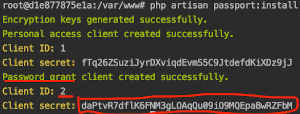
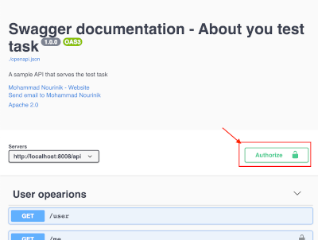

# Matrix multiplication

A Laravel application for Matrix multiplication. The app features a REST-API with authentication (oauth2/laravel passport).

## How to run

Since the application is fully dockerized the only thing that needs to be installed on host machine is docker.
for make the app up and running please run the following command in the project root directory:

```shell script
docker-compose up -d
```

> It might take a while after first run to install composer and run migrations, to make sure if everything is done
> properly please run `docker-compose logs -f core` (it will be done with running seeder as a migration).

> Note that you need to generate oauth key-pairs and password grant client to call protected apis, to do so please read 
> [Swagger-ui](#swagger-ui) section.

## Technical details

This app contains three containers:

- Application `core` container (application + NginX)
- `database` (mysql 8)
- `swagger-ui` for api documentation

#### Core

Core container, contains entire application including, `composer` and `nginx`. Base url to access core container form 
the host machine is `http://localhost:8008/`.

For getting access to core container command line, int the project root (the place where the `docker-compose.yml` file
is located) you amy run `docker-compose exec core bash`. it will open a session to access command line via bash 
interpreter into the core container.

#### Database

We have an instance of mysql 8 as the database container. you may access this database via following credentials from 
the host machine:

- port: `8306`
- root's password: `localhostrootpwd`
- default schema: `aboutyoutest`
- username: `mysql`
- password: `mysql`

#### Swagger-ui

In order to access swagger ui please open [localhost:8009](http://localhost:8009) in a browser.

Since end points are protected via laravel passport guard, it needs to authenticate via a user with swagger-ui, to do so you may follow the instruction below.

###### install laravel passport. 

To install laravel passport it needs to be run `php artisan passport:install`, 
as you may know (and according to the documentation) it will generate oauth key-pair as well as 2 clients. The first client (id: 1) is personal access client, 
but since we are going to authenticate a sample seeded user via password grant we need to copy and keep client secret of of the second client (id: 2),
which is a password client.



###### authenticate via swagger-ui.

To authenticate via swagger-ui, first please press `Authorize` button in top right and fill in the form with following values:



- username: `admin@aboutyou.de`
- password: `password`
- client_id: `2`
- client_secret: the token you've copied on step 1

and press `Authorize` button


Now you may open any api, press on `Try it out` and send your custom body to get proper response.

## Tests

Due to run tests, in core container please run the following command:

```shell script
vendor/bin/phpunit
```

Tests are divided to following groups:

 - `authentication` (everything regarding authentication)
 - `basic-rules` (test usage of laravel embedded rules)
 - `calculate` (Test calculations)
 - `default`
 - `failure` (All tests with assertion of an exception or a kind of failure)
 - `feature` (All feature tests)
 - `in-memory-database` (Tests that require an in-memory database)
 - `matrix-rule` (Tests related to implemented matrix rule)
 - `multiplicable-rule` (Tests related to implemented multiplicable rule)
 - `multiply-service` (Test multiply service)
 - `repository` (All tests related to repositories)
 - `rules` (All tests over implemented rules)
 - `services` (Tests related to services)
 - `success` (Tests that assert normal and success scenarios)
 - `to-excel-column-name-converter-service` (Test to-excel-column-name-converter service)
 - `unit` (All unit tests)
 - `user` (Tests related to user entity)
 - `user-service` (user service tests)
 - `validation` (All tests related to validations, rules and requests)

in order to run a group of test you can run tests via following command:

```shell script
vendor/bin/phpunit --group {group-name}
```

## Code Sniffer

For run code sniffer, in the `core` container run the following command:

```shell script
vendor/bin/phpcs
```

## Author

- Mohammad Nourinik - [github](https://github.org/enourinick/), [linkedin](https://www.linkedin.com/in/mohammad-nourinik-b7435236/)

Powered by [laravel](https://laravel.com)

<p align="center"></p>
